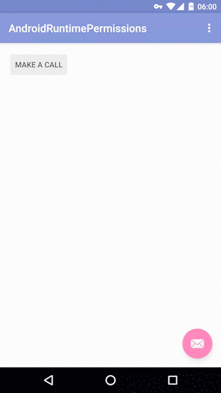

# Android 6.0 运行时权限

## 1. 引子

Android自诞生以来，其安全性一直被人们所诟病。加之，国内`安卓`App生态环境恶劣，只要是个应用，恨不得申请所有权限。谷歌或许也意识到这个问题，因此在[Marshmallow](https://www.android.com/versions/marshmallow-6-0/)包含了期待已久的运行时权限管理。

## 2. M时代之前
在Android 6.0之前，一个应用所需要的权限会在安装的时候列出，如果用户想安装这个应用，只能全盘接受。国内应用一般都是权限毒瘤，这一直以来都是安卓用户的痛中之痛。主要体现在两点：

- 无法动态授权
- 无法知道应用什么时候使用了权限

如果M之前的代码不加修改，直接跑在M手机上，可能导致应用崩溃。

## 3. M时代
Android中的权限分为两大类：普通权限和危险权限，具体可以参考[开发文档](http://developer.android.com/intl/zh-cn/guide/topics/security/permissions.html#normal-dangerous)。在M手机上，对于敏感权限，需要在程序运行时进行动态申请。对于非敏感权限，即[Normal Permissions](http://developer.android.com/guide/topics/security/normal-permissions.html)，和M之前的使用相同。

### 3.1 场景拆分

首先，上效果图：



场景拆解：
- 应用首次请求权限，系统弹出授权对话框（系统级，不可定制），包含`允许`和`拒绝`两个按钮。如果用户点击`允许`，应用拿到相应权限，如果点击`拒绝`，则进入下一个场景。
- 当上次授权用户点击`拒绝`，应用再次申请权限时，可以定制一个提示信息给用户，引导用户授权。例如效果图中的对话框，当用户点击`确定`，应用再次发起授权；若点击`取消`，授权中断。
- 从应用请求第二次授权开始，授权对话框会多出一个`不再弹出`的复选框。如果用户选中复选框，应用每次请求授权得到的授权结果都是**拒绝**。

接下来，让我们看看具体的实现细节。

### 3.2 请求权限

这里以最简单的电话权限举例。首先，需要在`AndroidManifest.xml`中声明`android.permission.CALL_PHONE`权限：

```
<uses-permission android:name="android.permission.CALL_PHONE"/>
```

接下来，在Activity中，使用[ContextCompat.checkSelfPermission()](http://developer.android.com/reference/android/support/v4/content/ContextCompat.html#checkSelfPermission(android.content.Context, java.lang.String))检查该权限是否授权，如果没有被授权，使用[requestPermissions()](http://developer.android.com/reference/android/support/v4/app/ActivityCompat.html#requestPermissions(android.app.Activity, java.lang.String[], int))进行权限申请。需要为每一个权限指定一个id，当系统返回授权结果时，应用根据id拿到授权结果。

```
if (ContextCompat.checkSelfPermission(this, android.Manifest.permission
        .CALL_PHONE) != PackageManager.PERMISSION_GRANTED) {
    ActivityCompat.requestPermissions(MainActivity.this, new
            String[]{android.Manifest.permission.CALL_PHONE}, REQUEST_PERMISSION_CALL_PHONE);
} else {
    Log.d(TAG, "call phone permission granted.");
    startActivity(intent);
}
```

### 3.3 授权回调

当应用申请权限后，Activity将触发一个回调[onRequestPermissionsResult()](http://developer.android.com/reference/android/support/v4/app/ActivityCompat.OnRequestPermissionsResultCallback.html#onRequestPermissionsResult(int, java.lang.String[], int[]))，告诉应用用户的授权结果。

```
@Override
public void onRequestPermissionsResult(int requestCode, String[] permissions, int[] grantResults) {
    if (requestCode == REQUEST_PERMISSION_CALL_PHONE) {
        if (grantResults[0] == PackageManager.PERMISSION_GRANTED) {
            call10086();
        } else {
            Toast.makeText(this, "Permission denied.", Toast.LENGTH_SHORT).show();
        }
    }
    super.onRequestPermissionsResult(requestCode, permissions, grantResults);
}
```

### 3.4 授权提示

当应用首次申请权限时，如果用户点击拒绝，下次再申请权限，Android允许你提示用户，你为什么需要这个权限，好引导用户是否授权。这个功能通过[shouldShowRequestPermissionRationale()](http://developer.android.com/reference/android/support/v4/app/ActivityCompat.html#shouldShowRequestPermissionRationale(android.app.Activity, java.lang.String))实现。例如，可以弹出一个对话框提示用户：

```
if (ActivityCompat.shouldShowRequestPermissionRationale(this, Manifest
        .permission.CALL_PHONE)) {
    AlertDialog.Builder builder = new AlertDialog.Builder(this);
    builder.setTitle("说明")
            .setMessage("需要使用电话权限，进行电话测试")
            .setPositiveButton("确定", new DialogInterface.OnClickListener() {
                @Override
                public void onClick(DialogInterface dialog, int which) {
                    ActivityCompat.requestPermissions(MainActivity.this, new
                            String[]{android.Manifest.permission.CALL_PHONE}, REQUEST_PERMISSION_CALL_PHONE);
                }
            })
            .setNegativeButton("取消", new DialogInterface.OnClickListener() {
                @Override
                public void onClick(DialogInterface dialog, int which) {
                    return;
                }
            })
            .create()
            .show();
} else {
    ActivityCompat.requestPermissions(this, new String[]{android
            .Manifest.permission.CALL_PHONE}, REQUEST_PERMISSION_CALL_PHONE);
}
```

如果用户点击对话框`取消`按钮，授权结果；如果点击`确定`按钮，再次申请权限。具体交互可以看效果图。完整代码请戳[这里](AndroidRuntimePermissions/app/src/main/java/com/aaron/androidruntimepermissions/MainActivity.java)。

## 轮子

通过上面讲解，大家也可以看出，虽然动态权限的编码逻辑简单，涉及的Api也就几个。但由于申请权限的位置和授权结果回调分别在两个地方，给人的感觉就一个字**乱**；并且，如果Activity规模较大、需要申请权限较多时，代码就会变得混乱。针对这些，前辈们封装了许多[动态权限第三方库](https://gist.github.com/dlew/2a21b06ee8715e0f7338)，这里拿[PermissionsDispatcher](https://github.com/hotchemi/PermissionsDispatcher)进行说明。PermissionsDispatcher具有如下优点：

- 采用注解，代码形式简洁；
- PermissionsDispatcher采用编译时生成代理类，让Activity/Fragment调用。因此，在效率上和官方写法没有区别。

## 总结

- 动态授权，对于一些流氓应用是十分有必要的。但是，有些超级流氓，如果你不授权就直接退出应用，也是无奈，比如某宝...
- ，如果Activity规模较大、需要申请权限较多时，代码就会变得混乱。

针对第二点，前辈们封装了不少库。

- [PermissionGen](https://github.com/lovedise/PermissionGen) 
- [RxPermissions](https://github.com/tbruyelle/RxPermissions)
 
PermissionGen使用相对简单，RxPermissions支持RxJava，大家可以根据项目需要进行选择。

## 参考

- [Working with System Permissions](http://developer.android.com/training/permissions/index.html)
- [Requesting Permissions at Run Time](http://developer.android.com/training/permissions/requesting.html)
